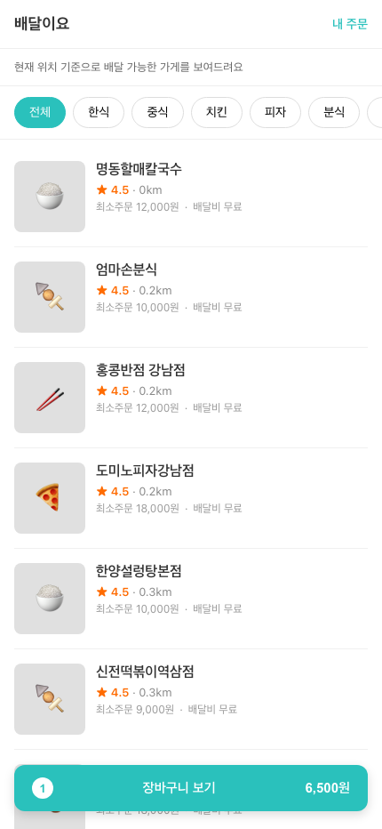
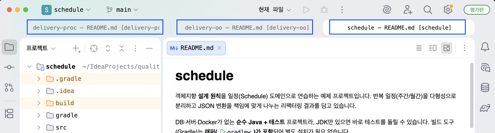

# **quality-course**
### 테스트 용이성 - AI 시대에도 유지보수하기 쉬운 코드 작성하기 예제 코드

## 1. 프로젝트 받기

```bash
git clone https://github.com/eternity-ddd/quality-course
cd quality-course
```

> 저장소 주소: https://github.com/eternity-ddd/quality-course

위 프로젝트를 받은 후에 quality-course 폴더 안으로 이동하면 아래와 같이 세 개의 폴더가 있습니다.

| 폴더 | 내용 | 스택 | 상세 |
| --- | --- | --- | --- |
| [`schedule`](schedule/README.md) | 일정 도메인 — **객체지향 설계 원칙** 예제 | 순수 Java | [README](schedule/README.md) |
| [`delivery-oo`](delivery-oo/README.md) | 음식 배달 도메인 — **객체지향(OO/DDD)** 구현 | Spring Boot + React | [README](delivery-oo/README.md) |
| [`delivery-proc`](delivery-proc/README.md) | 음식 배달 도메인 — **절차적** 구현 | Spring Boot + React | [README](delivery-proc/README.md) |

> `delivery-oo` 와 `delivery-proc` 는 **배달앱을 객체지향과 절차적인 방식으로 구현한 비교용 프로젝트**입니다.
> 두 프로젝트를 열어서 설계 차이를 비교해 보세요.

---

## 2. 사전 준비물

| 도구 | 버전 | 필요한 곳 |
| --- | --- | --- |
| JDK (Java) | **17** | 전 프로젝트 |
| Node.js | **20 이상** | `delivery-*` 프론트엔드 |

빌드 도구(Gradle)는 각 프로젝트에 **래퍼(`gradlew`)가 포함**되어 따로 설치할 필요가 없습니다.
`delivery-*` 의 데이터베이스는 **인메모리 H2**라 MySQL·Docker 설치도 필요 없습니다.

### JDK 17 설치

**macOS**

```bash
brew install --cask temurin@17
# 또는 SDKMAN
curl -s "https://get.sdkman.io" | bash
source "$HOME/.sdkman/bin/sdkman-init.sh"
sdk install java 17.0.13-tem
```

**Linux**

```bash
sudo apt update && sudo apt install -y openjdk-17-jdk    # Ubuntu/Debian
sudo dnf install -y java-17-openjdk-devel                # Fedora/RHEL
```

**Windows**: Eclipse Temurin 17 설치 후 `java -version` 확인.

### Node.js 20+ 설치 (delivery 프론트엔드용)

```bash
# macOS / Linux — nvm 권장
curl -o- https://raw.githubusercontent.com/nvm-sh/nvm/v0.40.1/install.sh | bash
nvm install 20
```

**Windows**: nodejs.org 에서 LTS(20+) 설치.

확인:

```bash
java -version    # 17.x
node -v          # v20 이상
```

---

## 3. 실행 방법

### delivery-oo / delivery-proc (백엔드 + 프론트엔드)

가장 쉬운 방법은 동봉된 스크립트입니다.

**macOS / Linux**

```bash
cd delivery-oo          # 또는 delivery-proc
chmod +x start.sh stop.sh   # 최초 1회 (실행 권한)
./start.sh              # 백엔드 + 프론트 한 번에 기동
./stop.sh               # 중단
```

**Windows**

```bash
cd delivery-oo
start.bat    :: 백엔드/프론트가 각각 새 창으로 뜸
stop.bat     :: 중단
```

기동까지 30초쯤 걸립니다. 준비되면 아래 주소로 접속하세요. 두 프로젝트는 **포트가 달라 동시에 띄워 비교**할 수 있습니다.

| 프로젝트 | 프론트엔드(접속) | 백엔드 |
| --- | --- | --- |
| `delivery-oo` | http://localhost:5173 | http://localhost:8080 |
| `delivery-proc` | http://localhost:5174 | http://localhost:8081 |

> 직접 띄우고 싶다면 — 터미널 1: `./gradlew :backend:bootRun` / 터미널 2: `cd frontend/api && npm install && npm run dev`

기동 후 브라우저에서 접속하면 아래와 같은 배달 앱 화면을 볼 수 있습니다.

| delivery-oo (localhost:5173) | delivery-proc (localhost:5174) |
| --- | --- |
|  |  |

### schedule (테스트로 설계 검증)

아래와 같이 테스트를 실행해서 `BUILD SUCCESSFUL` 이 뜨면 정상입니다.

```bash
cd schedule
./gradlew test          # macOS/Linux
```

```bash
gradlew.bat test         :: Windows
```

---

## 4. IDE에서 열기

각 프로젝트가 독립 빌드이므로 **하위 폴더를 각각 별도 프로젝트로 열어주세요.**

- IntelliJ: `delivery-oo`, `delivery-proc`, `schedule` 폴더를 각각 **Open**
- 최상위 `quality-course` 폴더를 열면 셋이 하나의 빌드로 묶이지 않으니 주의하세요.

다음과 같이 인텔리제이 안에서 세 개의 프로젝트가 별도로 import되어 있으면 됩니다.



---

## 5. 자주 묻는 질문 / 주의사항

- **포트**: `delivery-oo`(8080/5173)와 `delivery-proc`(8081/5174)는 서로 다른 포트를 쓰므로
  **두 프로젝트를 동시에 띄워 나란히 비교**할 수 있습니다.
- **데이터가 사라져요**: `delivery-*` 는 인메모리 H2라 **재시작하면 초기화**되고 샘플 데이터가 다시 로드됩니다. 정상적인 상태입니다.
- **DB 콘솔**: 백엔드 실행 중 `http://localhost:8080/h2-console` (proc은 `8081`)
  (JDBC URL `jdbc:h2:mem:delivery;MODE=MySQL;DB_CLOSE_DELAY=-1`, 사용자 `sa`, 비밀번호 없음)
- **이 자료는 멀티 모듈이 아닙니다**: 빌드·실행은 항상 각 프로젝트 폴더 안에서 합니다.
